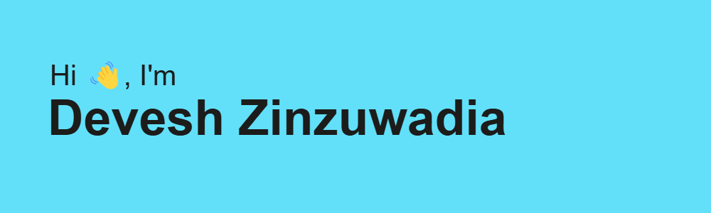

<h1 align="center">About me</h1>

I am a Full-Stack Cross-Platform App Developer and a Knight badge holder on LeetCode (1917 rating), currently pursuing my Bachelor's degree in Computer Science from Vishwakarma Institute of Information Technology, Pune. I strive to build meaningful applications with scalable architecture and best UI/UX practices, combining creativity with technical precision to deliver impactful solutions.

  
  
  
  

## 📊 GitHub Stats

  <table>
    <tr>
      <td>
        
      </td>
      <td>
        
      </td>
    </tr>
  </table>

<h1 align="center">Heatmap</h1>

<h1 align="center">Technologies used</h1>

  
  
  
  
  
  
  
  
  
  
  
  
  
  
  
  
  
  
  
  

